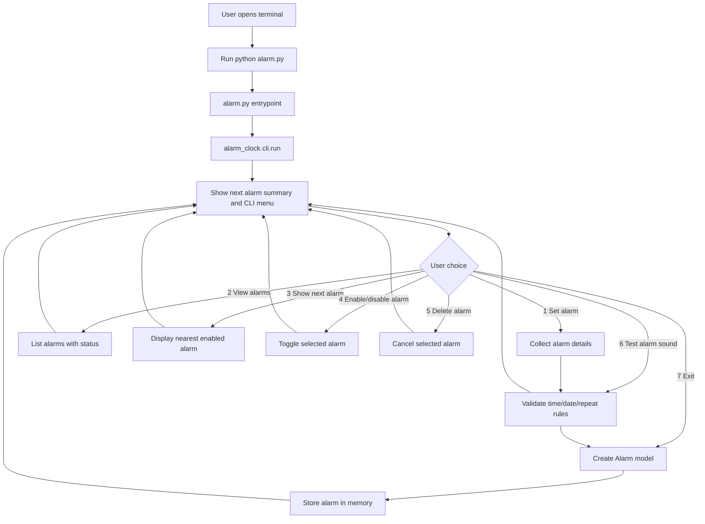
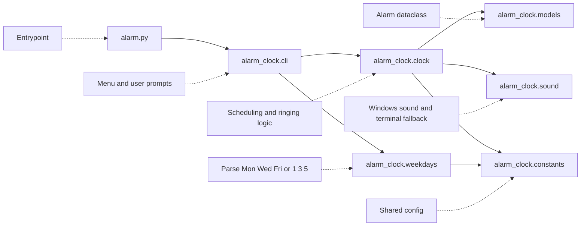
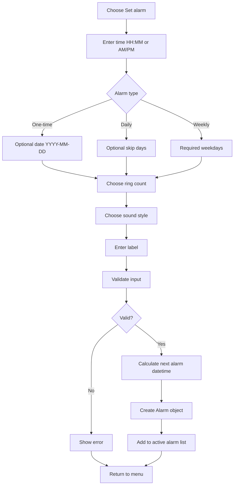
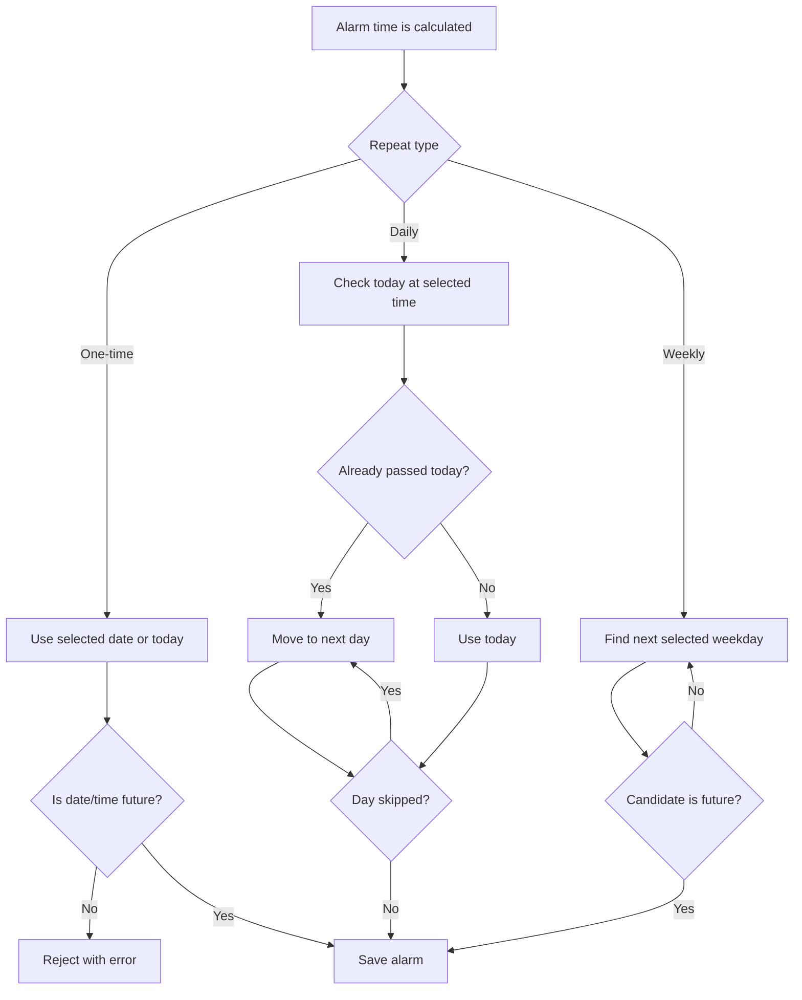
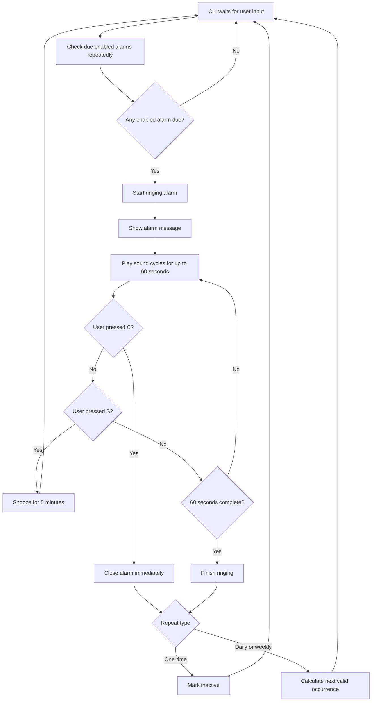
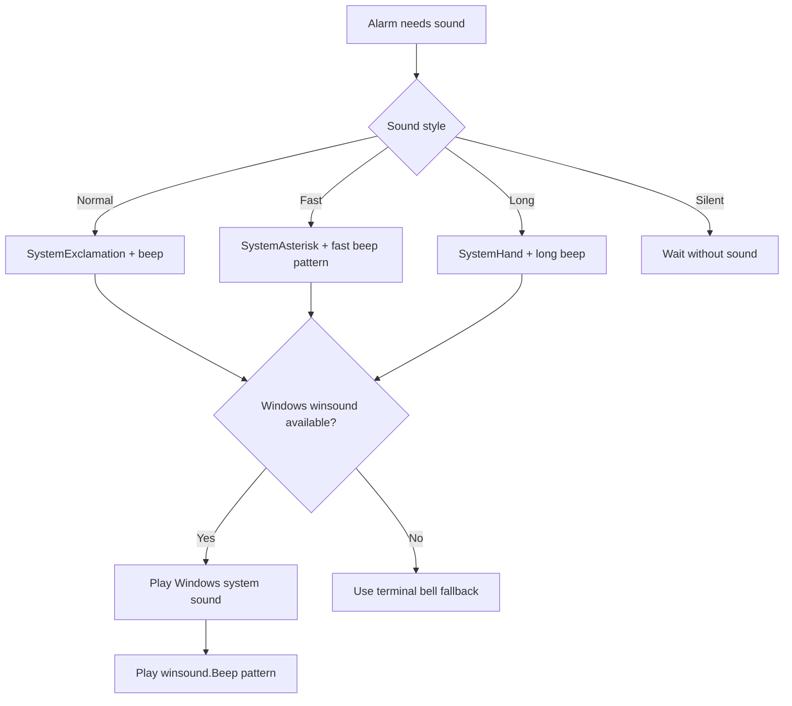
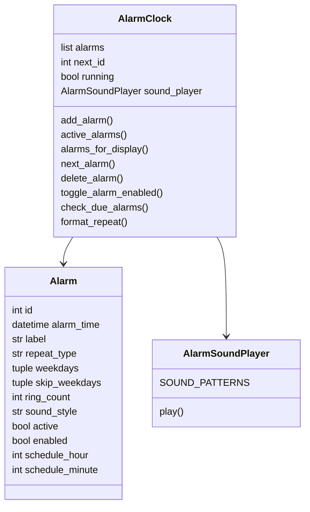
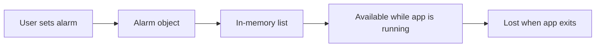

# System Design: Alarm Clock CLI

This document explains the flow and module design of the Python CLI alarm clock.

## High-Level Architecture

## Folder Responsibility

## Alarm Creation Flow

Supported time inputs include `21:20`, `09:20 PM`, `09:20 AM`, and `9:20 PM`.

## Repeat Scheduling Flow

## Runtime Alarm Check Flow

## Sound Flow

## Data Model

## Current Storage Design

The app stores alarms in memory only.

This matches the current project requirement: no database. If persistence is
needed later, a JSON file can be added without changing the CLI flow much.

## Main Design Decisions

- CLI only, no web UI
- No database
- Simple in-memory alarm list
- Separate modules for clean architecture
- `alarm.py` kept as a small launcher
- Windows sound support through `winsound`
- Terminal fallback for non-Windows systems
- 24-hour and AM/PM time input are both accepted
- Disabled alarms remain visible but do not ring
- Next alarm preview uses the nearest enabled alarm
- Snoozed alarms ring again after 5 minutes
- Daily and weekly recurrence calculated from the next valid future date
- Alarm ringing lasts up to 60 seconds
- User can close a ringing alarm with `C`
- User can snooze a ringing alarm with `S`
